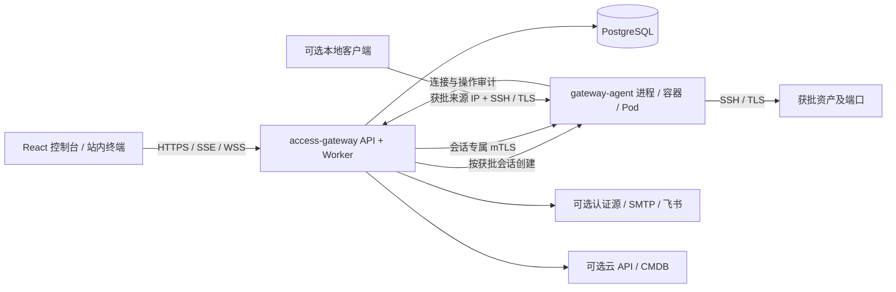
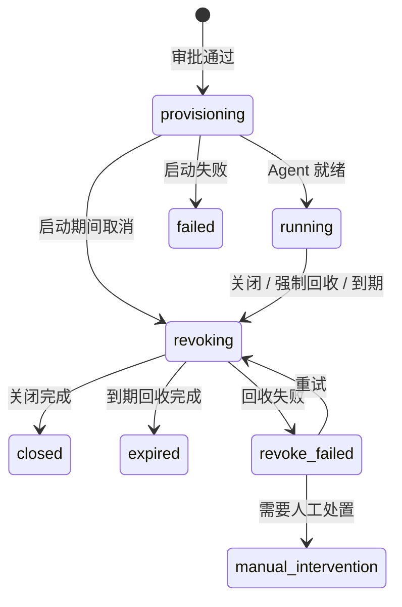

# 架构设计

[项目首页](../README.md) · [模块实现](02-ModuleImplementation.md) · [本地开发](03-LocalDevelopment.md) · [部署运维](04-Deployment.md)

## 目标与边界

access-gateway 为生产资产提供经过审批、有明确有效期、可主动回收的临时访问。授权绑定申请人、资产、端口、目标账号、访问方式及到期时间；浏览器和客户端不能将授权替换为任意目标。

平台负责身份、审批、网络入口和审计。目标数据库、SSH 或应用仍执行自身账号权限检查。站内终端需要资产端口启用操作审计并配置目标身份校验；原生加密透传适用于本地客户端，不解析业务内容。

## 组件与访问链路

| 组件 | 职责与状态 |
| --- | --- |
| `apps/web` | React 控制台、xterm.js 终端、查询缓存；不保存目标登录凭据 |
| `cmd/access-gateway` | 同进程提供静态网页、HTTP API、SSE、终端桥接和后台任务 |
| PostgreSQL | 用户、目录、审批、会话、审计、通知、任务、一次性挑战与初始化状态 |
| `cmd/gateway-agent` | 每个获批会话启动一个实例，执行连接限制、协议代理、TTL 和审计投递 |
| `cmd/migrate` / `cmd/account` | 显式数据库迁移、首次初始化和本地账户维护 |
| HTTPS 入口 | Docker 使用 Nginx 等反向代理；Kubernetes 使用 Ingress |

普通会话部署无需常驻网关集群或手工发布资产目录。控制平面从加密资产配置生成该会话所需的最小授权，Agent 不取得整库目标、平台主密钥或容器管理权限。

## 会话运行方式

| `GATEWAY_RUNTIME` | Agent 形式 | 适用环境 | 持久化与调度 |
| --- | --- | --- | --- |
| `local` | 独立本地进程 | 开发和调试 | `SESSION_AGENT_STATE_DIR` 保存进程身份、授权及审计 |
| `docker` | 独立容器 | 单台 Linux 主机 | 控制平面管理 Docker socket，Agent 使用自己的状态目录 |
| `kubernetes` | 独立 Pod | Kubernetes 集群 | 控制平面管理命名空间内的 Pod、Service、Secret 等资源 |

控制平面与 Agent 使用相同版本。Docker 会话容器复用应用镜像，Kubernetes 的 `SESSION_AGENT_IMAGE` 与控制平面使用相同 digest。开发启动脚本自动编译 Agent。

默认站内访问通过网站 WSS 和 Agent 私有 mTLS 管理入口传输。local/Docker 的站内专用会话不向用户开放 TCP 端口；Kubernetes 不为此创建 NodePort。本地客户端访问需先开启系统开关，再在申请中明确选择，使用独立客户端主机与临时端口。

`PUBLIC_URL` 决定网页来源、回调和邀请链接。本地客户端入口在系统设置中单独配置；网页域名不一定能承载数据库或 SSH 的 TCP 流量。

## 申请、审批与回收

1. 用户选择启用的资产、端口、目标账号和时长，携带 `Idempotency-Key` 提交申请。本地客户端申请还要填写网关实际看到的来源 IP。
2. 服务校验权限与资源状态，按资产关联的审批流程生成审批快照。未关联有效流程时拒绝普通申请，不回退到旧审批人。
3. 当前节点的审批人处理待办；禁止自批。紧急申请提高可见性，仍执行审批。
4. 最终审批通过后确定绝对到期时间，在同一事务内保存状态、通知和 outbox 任务。
5. Worker 领取任务并创建 Agent，检查就绪和协议一致性，成功后会话进入 `running`。
6. 用户关闭、管理员强制回收、资源停用或 TTL 到期触发回收。停止监听并断开现有连接，保存审计结果后回收运行资源。

会话最长 5 小时，并受资产与系统上限约束。计时从最终审批通过开始，包含启动和未连接的时间；进程重启、任务重试与终端重连不会延长授权。网页断开只结束当前终端连接，结束会话会关闭全部连接。每个会话最多五条并发连接。

## 数据一致性与恢复

服务层确定事务边界，repository 通过 `database/sql` 执行参数化 SQL。审批状态、会话事件、站内通知和 outbox 在本地事务内提交；外部网络调用在事务外执行。任务租约、幂等检查和补偿处理重复投递及控制平面重启。

OAuth state 和浏览器加密挑战保存在 PostgreSQL 中并原子消费，避免跨副本登录失败或重复使用。页面变更使用数据库 `LISTEN/NOTIFY` 在事务提交后通知 API 实例；事件仅触发重新查询，持久化业务数据仍是事实来源。

Agent 持久化会话状态和待确认审计。重启按原授权恢复或回收，终态记录阻止同一授权再次启动。审计不可用时终止操作连接；未确认记录用于补传证据，不用于重放业务命令。local/Docker 状态目录必须保留，Kubernetes 也需评估节点和临时卷丢失对未上报审计的影响。

应用启动仅检查 schema 版本，不执行 DDL。迁移由独立 goose 命令运行，历史迁移保持不变。

## 安全边界

- **身份与权限**：HttpOnly Cookie、同源写请求校验、RBAC 加对象归属检查。可读取他人审计记录不代表可以进入其终端。
- **浏览器敏感信息**：密码、私钥和敏感配置采用一次性挑战、RSA-OAEP 与 AES-256-GCM 信封；生产仍使用 HTTPS。
- **持久化密钥**：`ENCRYPTION_KEY` 派生不同用途的密钥，资产目标使用 AES-256-GCM 并绑定资产 ID；数据库备份必须与原密钥配套。
- **原生模式**：客户端与目标端到端 SSH/TLS，Agent 校验加密协商，只记录连接与流量。
- **审计模式**：客户端与 Agent、Agent 与目标分别加密；Agent 校验目标证书或 SSH 主机密钥，解析允许的协议并记录操作。
- **站内客户端**：目标登录信息只用于本次连接；本地 CLI 运行在受限环境，不得读取其他授权或连接未批准目标。Linux 缺少所需隔离能力时拒绝启动。
- **旧协议退出**：不再签发旧隧道凭据，不创建或恢复 `tunnel` / `direct` 会话。历史字段仅用于记录读取与拒绝旧授权，升级前先结束旧会话。

审计输出是访问证据的一部分。交互终端的输出与回显不能证明每个操作系统进程实际执行了什么；需要系统级证据时应结合目标系统审计。
